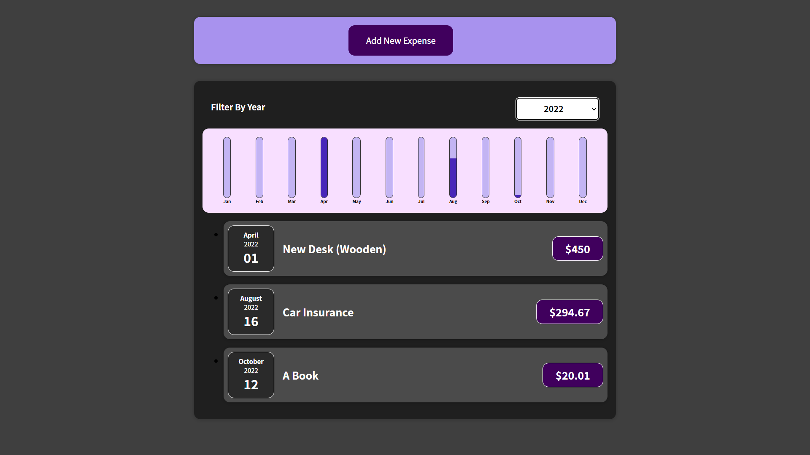
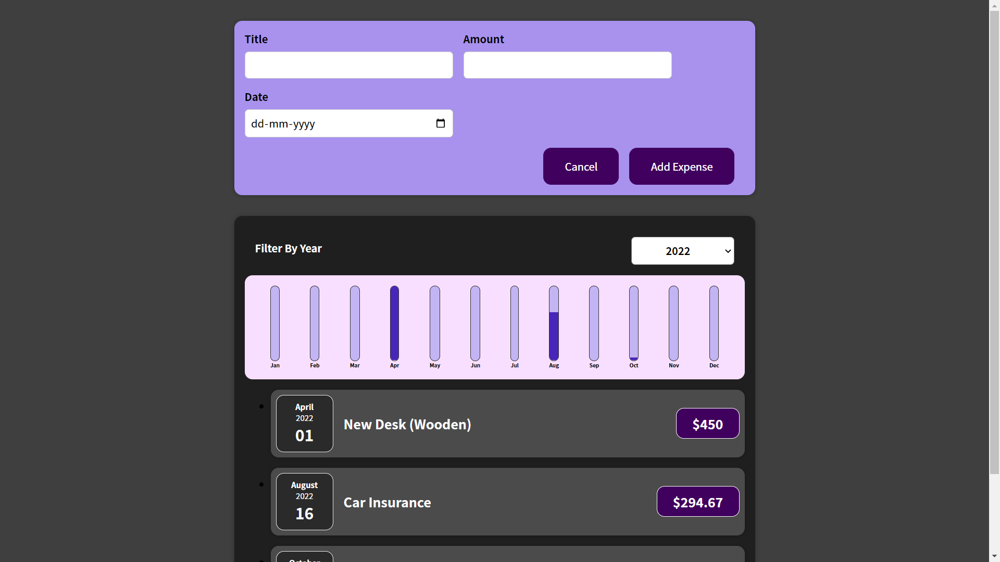

# Expense Tracker
Expense Tracker App.  
Provides Functionality to track yearly record of expenses.  
Also have functionality to display monthly expenses through chart.

## Setup
Clone Repo using below command and move to Project folder
```
git clone git@github.com:Bharat1002/Expense-Tracker.git
cd Expense-Tracker
```
Run below command to download dependencies
```
npm i
```
To start the app, run below command
```
npm start
```
## Project Pics

Add Expense Form
